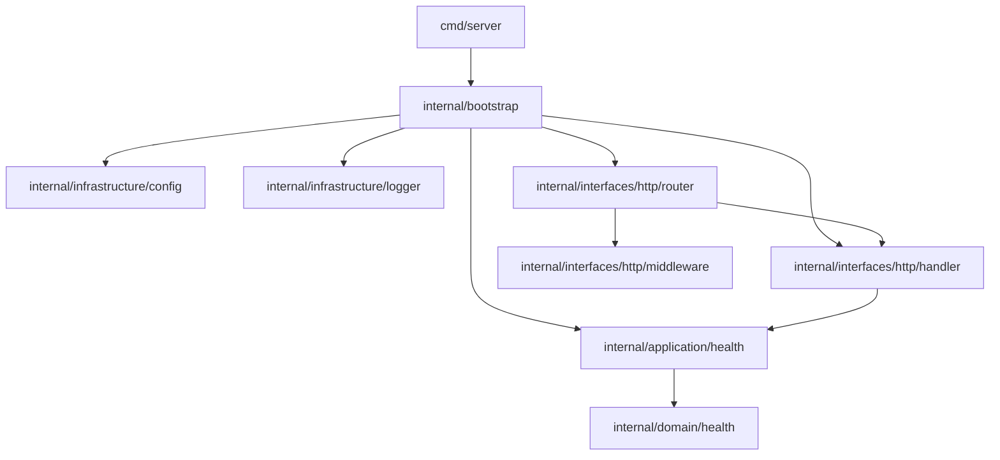
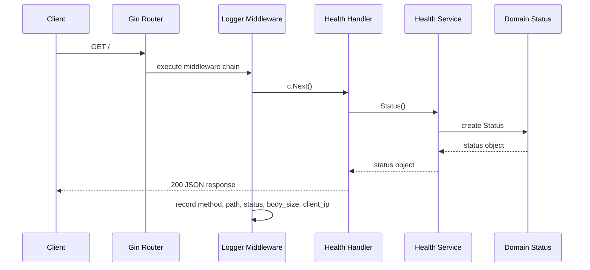
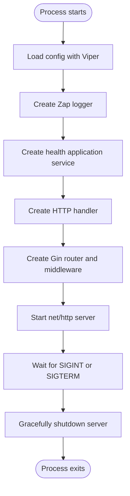
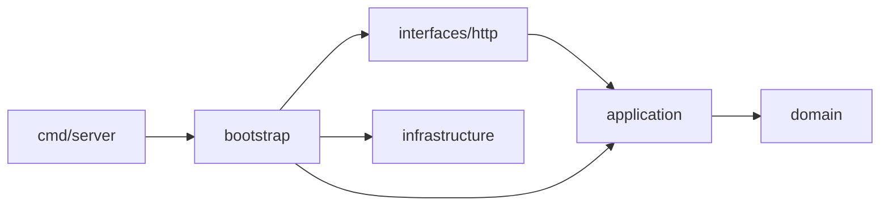

# Architecture

This project uses a small DDD-style layout. The current domain is intentionally minimal because the API only returns a static health response, but the package boundaries are ready for additional use cases.

## Layers

- `cmd/server`: starts the process, creates the HTTP server, and handles graceful shutdown.
- `internal/bootstrap`: wires configuration, logging, services, handlers, middleware, and routes.
- `internal/domain`: contains business objects.
- `internal/application`: contains use cases and application services that operate on domain objects.
- `internal/interfaces/http`: contains Gin handlers, middleware, and router setup.
- `internal/infrastructure`: contains technical concerns such as configuration and logging.

## Package Relationship

## Request Flow Algorithm

## Startup Algorithm

## Dependency Direction

Dependencies point inward toward the application and domain layers:

The router knows about HTTP handlers and middleware. The handler knows about the application service interface. The application service returns a domain object. Infrastructure packages do not contain request handling or business behavior.
